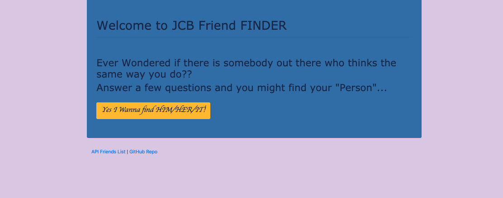
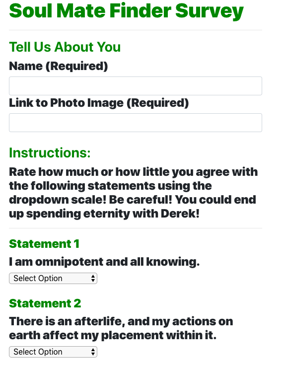

# FriendFINDER# Friend Finder

A compatibility-based "FriendFinder" application. This full-stack site will take in results from users' surveys, then compare their answers with those from other users. The app will then display the name and picture of the user with the best overall match!

___

### Description & Requirements
---
A "Good Place" themed Express web application that collects information from the user via survey, compares the users answers against a database of other users, and and uses the difference to compare and match them with their "Soul Mate".

**Before you get started, make sure you have these node packages installed:**
1. **Express:** A fast and minimalist web framework for node.

     *Command Line: 'npm install express'*

2. **Path:** - A node package that will allow you to set back end routes to your pages.

     *Command Line: 'npm install path'*

3. **nodemon:** - (*Optional*) A super useful tool when working and testing local servers. This package automatically refreshes your server everytime a change is saved within your code, eliminating the need to manually restart your server when logging changes. The only change the user has to make is when starting your server from the command line, you write *nodemon* rather than  *node* followed by your file name.

    *Command Line: 'npm install nodemon'*   

Read more about these methods [here](https://www.npmjs.com/)

### Notes
---
This is my second node project, but first time working with a server and creating a fullstack experience for my user. Per usual, the Javascript logic was the most challenging portion of it, but it made figuring it out extremely satisfying. Overall, I am happy with the functionality of the app, but I would love to go back and work on the styling after the class is done.
